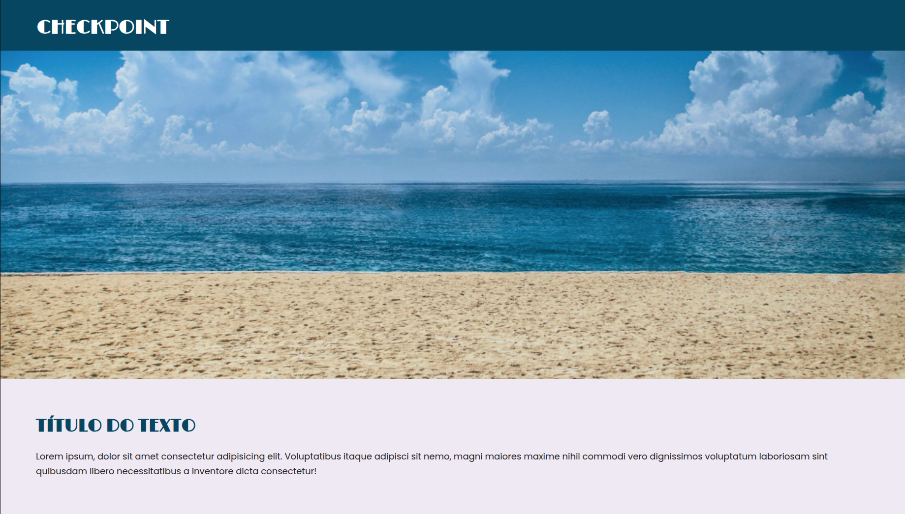

# Checkpoint 1 - Front-End

Projeto de uma landing page de viagens desenvolvido com HTML e CSS, com foco em reproduzir um layout proposto em checkpoint.

## Preview



## Sobre o projeto

A página apresenta:

- Header com identidade visual
- Banner principal
- Seção de introdução
- Seção "Por Que Viajar Conosco"
- Cards de pacotes em destaque
- Galeria de imagens
- Seção de contato com ícones
- Rodapé com informações do aluno

## Tecnologias utilizadas

- HTML5
- CSS3
- Google Fonts (Limelight, Poppins e Material Symbols)

## Como executar

1. Clone o repositório.
2. Abra a pasta do projeto no VS Code.
3. Abra o arquivo `index.html` no navegador.

Dica: se quiser uma experiência melhor de desenvolvimento, use a extensão Live Server.

## Estrutura de arquivos

```text
cp_front/
├── .github/
│   └── image.png
├── images/
├── index.html
├── style.css
└── README.md
```

